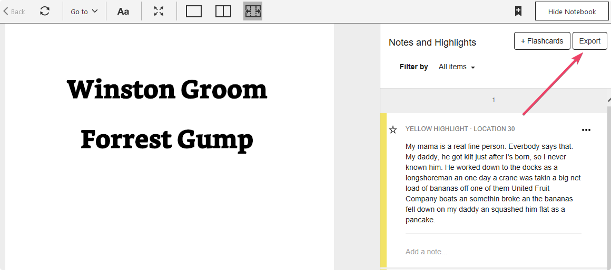
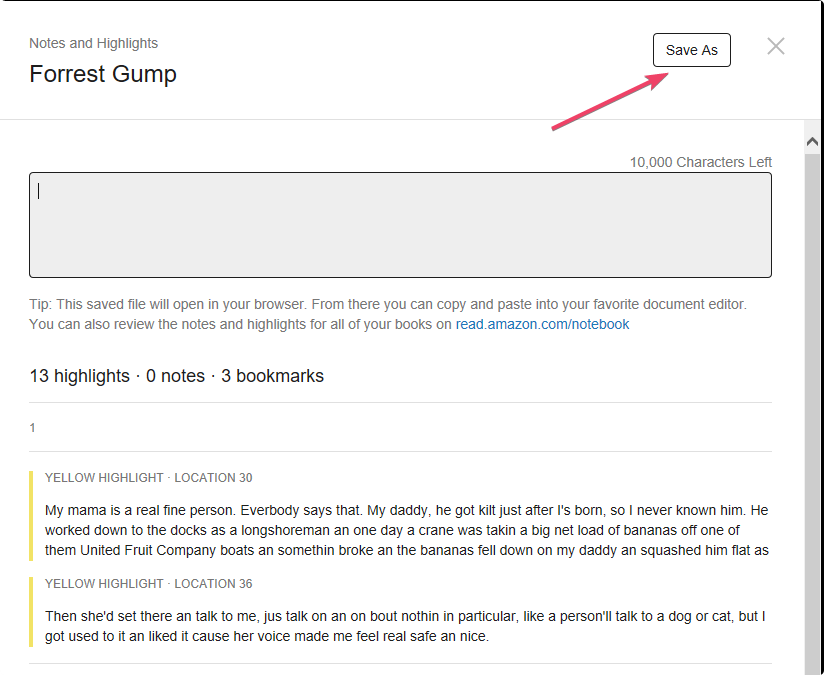
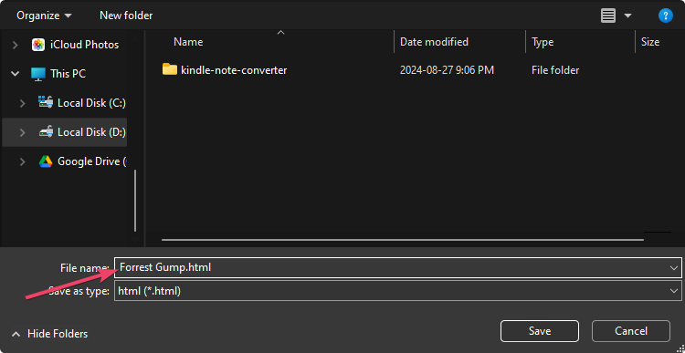

## Description

Dotnet console utility to convert Kindle notebooks from HTML format to Markdown

## Usage

### Arguments

- `-p` or `--path` - path to kindle notebook in HTML format
- `-o` or `--outputPath` - path to kindle notebook in MD format (optional; if not provided the directory of HTML notebook file will be used)

### Usage with dotnet-cli

```ps1
dotnet run -p "Forrest Gump.html"
```

### Usage as dotnet-tool

1. Navigate to KindleNoteConverter.Notebook.Console directory
2. Pack dotnet nuget package
3. Install package as dotnet global tool

#### Pack dotnet nuget package

```ps1
dotnet pack
```

#### Install package as dotnet global tool

```ps1
dotnet tool install --global --add-source ./nupkg kindle-notemd
```

#### Usage

It will be available from any place in console

```ps1
kindle-notemd -p "Forrest Gump.html"
```

## How to export Kindle notebook

1. Click on "Export" button in "Notes and Highlights"



2. Click on "Save As" button on opened page with highlights



3. Save notebook



4. Pass the saved notebook path to convert HTML notebook format to Markdown
